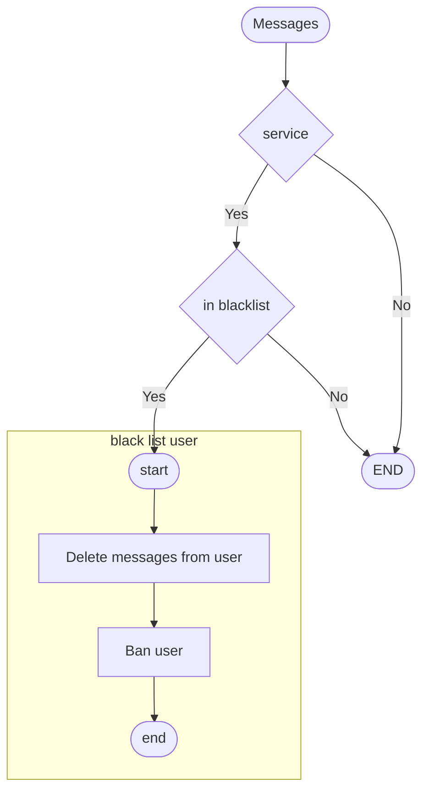

# Userbot

## run

### venv run

```shell
python3 -m vnev venv
source venv/bin/activate
# some libraries require, Google for each distro
pip install -r requirements.txt

# edit configs
cp .env.example .env

# build database
python main.py rebuild
# run the script
python main.py
```

### levels

- Group



### docker

- due to docker limit, it is not possible to login inside docker image.
- docker is not support until I have idea how to login with docker container.

## author

- [allen0099](https://github.com/allen0099)
